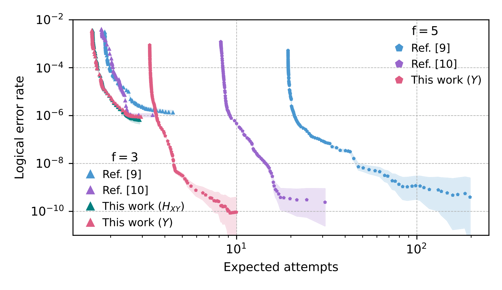

# Fold-transversal surface code cultivation

(Or, as we wanted to name our work: *Growtation and Foldosynthesis*)

See our [arxiv manuscript](https://arxiv.org/abs/2509.05212) for details.

`` src `` has code to generate some sample fault-distance 3 $|Y\rangle$-state cultivation circuits. Only stabilizer-based escape is supported for now. Some utility functions in this folder are lifted from the original magic state cultivation [Zenodo repository](https://zenodo.org/records/13777072).

`` data `` has `` sinter `` outputs from sampling circuit variants we tried, along with results from previous literature.

This repository will continue to be updated in the following weeks with more cultivation variants and handoff code for exact non-Clifford state simulation.

A summary of our protocol's perfomance, also in Fig.2 of our manuscript, is below:

